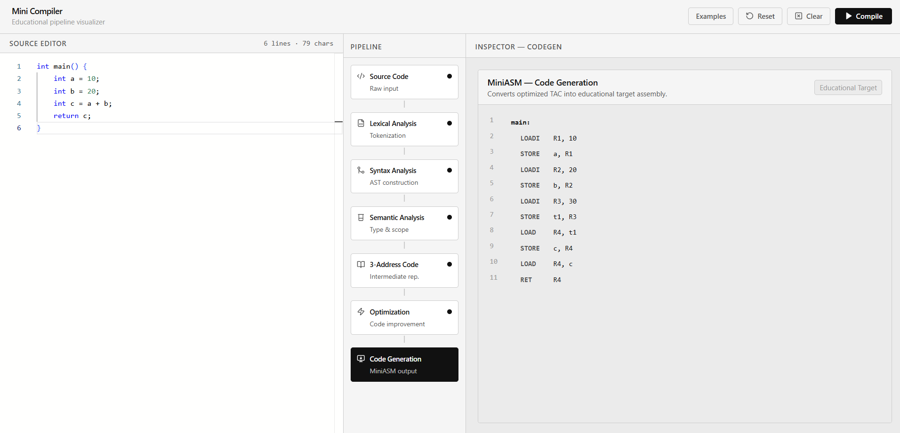

# Mini Compiler Pipeline Visualizer

An interactive educational web application that visually demonstrates the full compiler pipeline, from source code to target machine assembly, for a custom C-like language (MiniLang).

## Screenshots

*(Save your UI screenshot as `screenshot.png` in the same directory as this file to display it here!)*

## Project Overview

The goal of this project is to implement a simple compiler and code generator for a small subset of a C-like programming language. It is designed to be an educational tool, allowing students and developers to visually step through the compilation phases instead of relying on opaque command-line logs.

## Features

- **Interactive Source Editor**: Monaco-editor powered IDE interface.
- **Visual Pipeline**: Step-by-step animation of compiler phases.
- **Lexical Analysis**: Custom lexer that generates a stream of tokens.
- **Syntax Analysis**: Recursive descent parser building an AST, visualized interactively with React Flow.
- **Semantic Analysis**: Type checking, scope validation, symbol table generation, and static loop analysis.
- **Three Address Code (TAC)**: Intermediate representation generation with temporary variables.
- **Optimization**: Basic constant folding, propagation, algebraic simplification, and dead code elimination passes, presented with a side-by-side diff.
- **Code Generation**: Converts optimized TAC into "MiniASM", an educational target assembly language.

## Architecture

- **Frontend**: React, TypeScript, Vite, Tailwind CSS, React Flow (for AST graphs), Monaco Editor.
- **Backend**: Python, FastAPI.

The backend exposes a REST API that receives the source code, runs it through all compiler phases sequentially, and returns structured data containing the outputs (Tokens, AST, Symbol Table, Warnings, TAC, Assembly) for each phase. The frontend acts as the visualization layer.

## MiniLang Grammar

A simple subset of a C-like language:
- **Types**: `int`, `float`, `bool`
- **Operations**: `+`, `-`, `*`, `/`, `<`, `>`, `<=`, `>=`, `==`, `!=`, `&&`, `||`
- **Control flow**: `if`, `else`, `while`
- **Functions**: Currently supports a single `main()` block and `return` statements.

## Compiler Phases

### 1. How the Lexer Works (Lexical Analysis)
The Lexer iterates character by character over the source code. It groups characters into logical chunks called **Tokens** (such as `KEYWORD`, `IDENTIFIER`, `INTEGER`, `PLUS`, etc.). Spaces and comments are ignored. If an invalid character is encountered, a Lexical Error is thrown with precise line and column coordinates.

### 2. How the Parser Works (Syntax Analysis)
Using a Recursive Descent approach, the Parser consumes the token stream generated by the Lexer. It enforces grammatical rules (e.g., matching parentheses, verifying statement structure). If successful, it builds an Abstract Syntax Tree (AST). 

### 3. Abstract Syntax Tree (AST)
The AST is a tree representation of the source code's grammatical structure. In the UI, the AST is visualized using nodes and edges (powered by React Flow), making it easy to see how mathematical precedence and nested blocks are interpreted.

### 4. Semantic Analysis
While the AST confirms the grammar is correct, the Semantic Analyzer verifies the "meaning". 
- It tracks variable declarations and scopes using a **Symbol Table**.
- It enforces strict type checking (e.g., you cannot add a `bool` and an `int`).
- It includes a static interpreter that warns about unreachable code, uninitialized variables, and possible infinite loops.

### 5. Three Address Code (TAC)
The AST is converted into a linear sequence of instructions known as Three Address Code. Each instruction has at most three operands (e.g., `t1 = a + b`). This simplifies the complex nested expressions of the AST and prepares the code for optimization.

### 6. Optimization
The optimizer runs several passes over the TAC to improve execution efficiency without changing behavior:
- **Constant Folding**: Computes constant expressions at compile-time (`2 * 3` becomes `6`).
- **Constant Propagation**: Replaces variables with known constant values.
- **Algebraic Simplification**: Removes redundant math (e.g., `x + 0` becomes `x`).
- **Dead Code Elimination**: Removes instructions whose results are never used.

### 7. Code Generation (MiniASM)
The final phase maps the optimized TAC instructions into an educational target assembly language (MiniASM). It uses a standard Load/Store architecture syntax (e.g., `LOAD R1, a`, `ADD R1, R2`, `STORE c, R1`).

## Example Programs

The application comes bundled with 7 example programs you can load from the "Examples" dropdown:
1. Basic Arithmetic
2. Constant Folding
3. If Statement
4. While Loop
5. Semantic Error (Undeclared Variables)
6. Type Error (Assigning bool to int)
7. Infinite Loop Warning

## API Endpoints

- `GET /health` : Checks server status.
- `POST /compile` : Expects `{ "sourceCode": "..." }`. Returns a comprehensive JSON object containing the `success` state and the outputs of all successfully completed compiler phases (`tokens`, `ast`, `symbolTable`, `tac`, etc.).

## How to Run

### Backend
1. Open a terminal and navigate to the `backend/` directory.
2. Create a virtual environment: `python -m venv venv`
3. Activate it: 
   - Windows: `venv\Scripts\activate`
   - Mac/Linux: `source venv/bin/activate`
4. Install dependencies: `pip install fastapi uvicorn pydantic`
5. Run the server: `python main.py`
*(The backend runs on `http://localhost:8000`)*

### Frontend
1. Open another terminal and navigate to the `frontend/` directory.
2. Install dependencies: `npm install`
3. Run the development server: `npm run dev`
4. Open your browser at the local URL (typically `http://localhost:5173`).

## Future Improvements

- Multi-function support (call frames, arguments).
- Arrays, pointers, and memory allocation.
- Advanced optimization passes (loop unrolling, peephole optimization).
- Target compilation to a real architecture (e.g., x86, ARM, or WASM).
